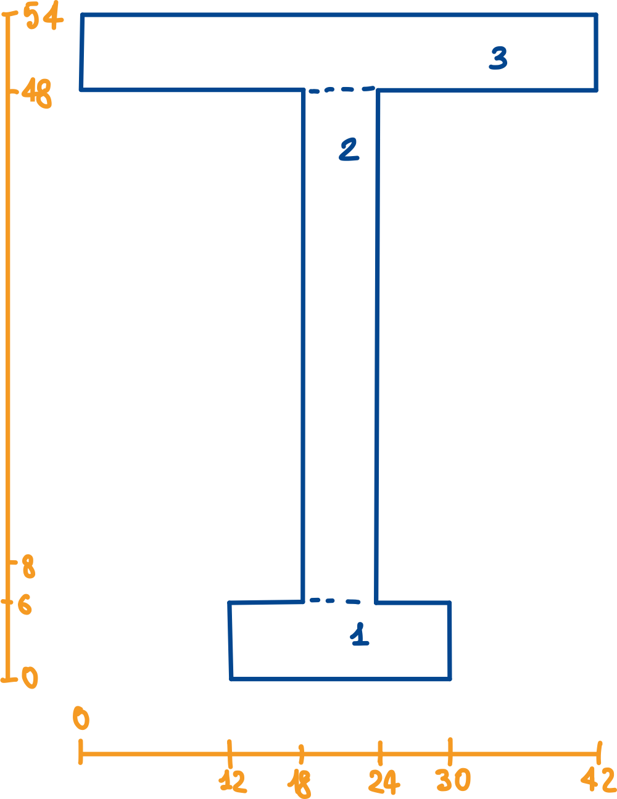

# Simple-section-inertia
This script returns the moment of inertia, that can be useful in Navier formula for bending tension, of simple, symmetrical, sections.
## Usage
Simply run the two given scripts in a terminal window and follows the instructions. <br>
```
python3 section.py
```
## Example
Let's consider this T section with the given dimensions in [mm]:

We can recognise three elementary subsections, as numbered on the images, whose dimensions are:

| Section | Width [mm] | Height [mm] | Height of center of gravity from the bottom [mm] |
| --- | --- | --- | --- |
| 1 | 18 | 6 | 3 |
| 2 | 6 | 42 | 27 |
| 3 | 42 | 6 | 51 |

While running the script, these elements will be prompted, as well as the shape of the elementary section: **R** for rectangles, **T** for triangles.

After the third subsection, we can leave the following field blank by returning. The script will output the results:

```
Area:  612.000000 mm^2
S_tot: 19980.000000 mm^3         
I_tot: 225967.764706 mm^4
```

| Section | Area | Static Moment | Local Inertia Moment |  Shift  | Global Inertia Moment  |
| --- | --- | --- | --- | --- | --- |
| 01. |   108.0 |   324.0 |   324.0 | 94926.4 | 95250.4 |
| 02. |   252.0 |  6804.0 | 37044.0 |  8036.1 | 45080.1 |
| 03. |   252.0 | 12852.0 |   756.0 | 84881.3 | 85637.3 |